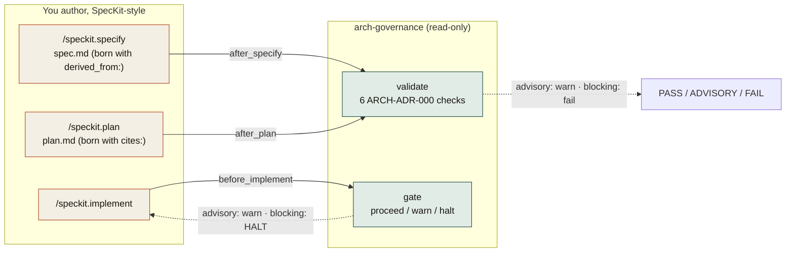
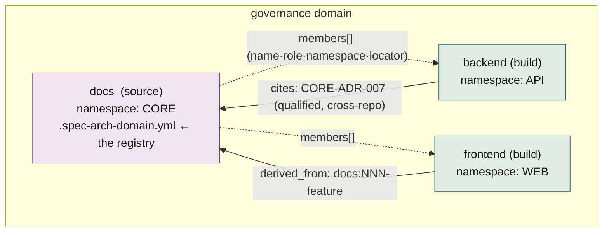
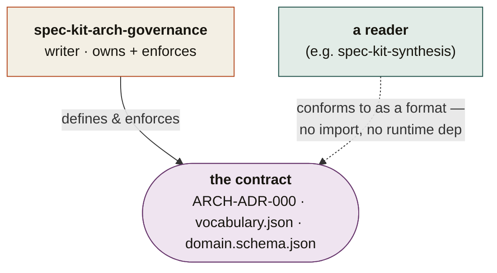

# spec-kit-arch-governance

**Keep specs, code & ADRs in sync — born-compliant SpecKit templates + a read-only citation validator that rides the lifecycle on every spec and plan, advisory first and blocking once proven.**

A standalone, interview-driven [SpecKit](https://github.com/github/spec-kit) extension that stops a project's **specifications, code, and architecture decisions** from drifting apart — regardless of how many repos the project has or what they're named. It discovers your topology by asking at install, makes typed citations between specs/plans/ADRs *exist* (templates), stay *true* (validator), and get *enforced* (lifecycle hooks). For multi-repo projects it ships a shared **domain manifest** so every repo self-configures with no fleet manager.

**Version:** 1.2.3 · **Requires:** spec-kit ≥ 0.1.0 · **License:** MIT · **Provides:** 6 commands, 3 hooks
**Repository:** <https://github.com/ashbrener/spec-kit-arch-governance>

> Citation/architecture **integrity** — *not* access control, and not generic “architecture linting.” It governs whether spec↔code↔ADR citations resolve, stay current, and remain immutable.

---

## Why

In any SpecKit project three artefact classes drift apart over time:

- **Specs** — the *what & why* (requirements, functional/architecture specs, plans).
- **Code** — the implementation.
- **ADRs** — the *why we chose X* rulings.

SpecKit drives **spec → code** (forward). Nothing drives **code → spec** (reverse) or keeps **cross-repo** references valid — so docs/ADRs silently rot, and in multi-repo setups the authoritative specs in one repo and the build in another fall out of step. This extension fills that gap.

| Without it | With it |
|---|---|
| “Why is it built this way?” has no reliable answer 6 months in | the *why* (ADRs) stays wired to the *what* (specs) and the *how* (plans) |
| a deleted/superseded ADR leaves dangling references nobody notices | the validator flags the broken citation, with the exact file and line |
| adding citations is manual, so nobody does it | specs/plans are **born** with `derived_from:` / `cites:` slots |
| multi-repo references go stale, namespaces collide | one shared manifest is the registry; cross-repo citations are validated |
| a cited upstream spec/ADR *changes* and the citing repo never hears about it | watermark **pins** record the accepted upstream state; `citations_fresh` surfaces the drift; `repin` reconciles it explicitly |
| enforcement is all-or-nothing | **advisory by default**; you flip to blocking per-repo only once it’s proven clean |

---

## How it works

Three guarantees, layered — *exist → true → enforced* — and the validator stays **read-only** throughout (writes are confined to the config, the citation slots, and an optional ADR scaffold).



1. **Exist** — born-compliant templates: install patches your `.specify/templates/{spec,plan}-template.md` so every generated spec carries a `derived_from:` slot and every plan a `cites:` slot. Adoption becomes the path of least resistance.
2. **True** — the read-only validator runs the six checks (below) on demand, in CI, and via hooks.
3. **Enforced** — `after_specify` / `after_plan` validate the new artefact; `before_implement` gates it. In `mode: advisory` everything only warns; flip a repo to `mode: blocking` (a guarded transition) and the gate refuses to start implementation while a citation is broken.

### What it enforces — the six checks (ARCH-ADR-000)

| Check | What it guarantees |
|---|---|
| `citations_resolve` | every `derived_from` / `cites` reference points at a record that exists |
| `citations_current` | cited ADRs aren’t `Superseded` / `Deprecated` (point at the successor) |
| `namespace_valid` | ADR IDs are well-formed and use this repo’s namespace |
| `adr_immutability` | accepted ADR bodies (above `## Amendments`) are unchanged since first commit |
| `governance_adopted` | the ADR README references the adopted governance ruling |
| `citations_fresh` | **pinned** citations still match the cited artifact’s current content (a stale pin = the upstream spec/ADR moved since you accepted it) |

### Freshness — watermark pins + explicit `repin`

The five original checks test *existence* and *status*; none can see a cited artifact whose
**content** changed after you derived from it (the reverse-propagation gap). Slice 006 closes it:

- **Pins** live in a per-repo, generated, git-tracked sidecar `.spec-arch-pins.yml` — the citation
  slots in your specs/plans are untouched, and the reader contract stays at vocabulary `0.3.0`.
  Each pin records the cited artifact’s content state (a line-ending-normalized SHA-256):
  `derived_from` pins the upstream feature’s `spec.md`; `cites` pins the full ADR file, so an
  appended amendment registers as movement. Offline and deterministic — no git or network access
  to the peer.
- **Detection**: a pinned citation whose upstream moved becomes a failure-severity
  `citations_fresh` finding (warns in `advisory`, **halts** `before_implement` in `blocking`).
- **Graceful adoption**: an *unpinned* citation is only ever a `note`-severity nudge — in every
  mode. No pin file, no change to your results. Seed the whole repo once with `repin --apply`.
- **Fail-safe**: an unreachable peer, unreadable artifact, or malformed pin file degrades to an
  indeterminate note — never a crash, never a false block. Only a *determinate* stale pin halts.
- **Explicit reconcile**: `repin` is dry-run by default (a per-citation plan: create / refresh /
  prune), and `repin --apply` is the **only** writer of pins — the pin file’s git history is the
  audit trail of which upstream state was accepted, and when.

### Visibility — the issues mirror (opt-in, slice 007)

Detection only reaches whoever runs validate. For teams that triage in GitHub issues, the
**optional, default-disabled** `issues` verb mirrors validated staleness facts — the determinate
`citations_fresh` failures from the same single engine — into GitHub issues:

- **Opt-in, explicit**: an `issues:` config section (`enabled: true` + `repository: owner/name`).
  Without it, every verb is byte-identical to pre-007 and nothing performs network access.
- **One issue per fact** (identity = the pin key), idempotent: re-runs never duplicate; a second
  upstream movement updates the *same* issue; a repin closes it with an audit comment naming the
  new pin state; an issue a human closed while still stale is respected — one note, recorded as
  dismissed, never re-opened. The emitter never deletes an issue.
- **Dry-run by default, fully offline** — the plan diffs facts against the tracked sidecar
  `.spec-arch-issues.yml` (written only by `issues --apply`; its git history is the emission
  audit trail). `--apply` is the only networked mode, via your ambient `gh` credential.
- **Never enforcement**: the verb runs in no lifecycle hook, and its failures (missing
  credential, rate limit, unreachable tracker) fail only its own run — validate and gate are
  untouched by construction. CI pattern: `validate` then `issues --apply` as separate steps
  (the not-enabled no-op makes the second step safe unconditionally).

---

## Install

Pre-catalog (from the tagged release archive):

```bash
specify extension add --from https://github.com/ashbrener/spec-kit-arch-governance/archive/refs/tags/v1.0.0.zip
```

Local development install (from a checkout):

```bash
specify extension add ~/path/to/spec-kit-arch-governance --dev
```

Once listed in the community catalog:

```bash
specify extension add arch-governance
```

Installing **registers the three hooks** into your `.specify/extensions.yml` (composing with any other extensions). It does **not** write your per-repo config — that’s the install ceremony below.

---

## Adopt — single repo

```bash
# 1. Interview → writes .spec-arch-governance.yml (role, namespace, mode, dirs), scaffolds a
#    governance ADR if you want one, and makes your SpecKit templates born-compliant.
/speckit.arch-governance.install

# 2. See the truth, read-only and advisory (also runs automatically after specify/plan):
/speckit.arch-governance.validate     # → PASS / ADVISORY (n) / FAIL (n)

# 3. Once proven clean, flip to blocking (guarded — refused while any citation fails):
#    set mode: blocking in .spec-arch-governance.yml
```

The namespace identifies the repo’s **role** in the domain (a `docs`/source repo vs a `backend`/build repo), not the project name. Existing ADRs written as plain `ADR-NNN` are recognised under that namespace — **zero renames**.

## Adopt — multi-repo (self-configuring, no fleet manager)

One shared **domain manifest** in the source/authority repo is the namespace registry; every other repo *pulls* its own config from it.



1. **Seed the manifest** once in the source repo (`.spec-arch-domain.yml`, listing each member’s `name · role · namespace · locator`).
2. **Each build repo self-configures on install** — it reads the manifest through its source locator, finds its own entry, and writes its own `.spec-arch-governance.yml` with **no interview**.
3. **Reconcile any time** with `/speckit.arch-governance.sync` — **dry-run by default**; `--apply` writes *only this repo’s* config, never a peer’s, never a remote.

Cross-repo citations use the fully-qualified form (`CORE-ADR-007`); a bare `ADR-NNN` is repo-local and never matches across a boundary — so namespaces can’t collide and references can’t silently cross wires.

---

## Commands & hooks

| Command | Runs | What it does |
|---|---|---|
| `speckit.arch-governance.validate` | on demand · `after_specify` · `after_plan` · CI | read-only — the six checks → PASS / ADVISORY / FAIL |
| `speckit.arch-governance.gate` | `before_implement` | proceed / warn / **halt** (blocking) — fail-closed, read-only |
| `speckit.arch-governance.install` | once per repo | interview → config, scaffold ADR, born-compliant templates (never writes pins — it prints the `repin --apply` command) |
| `speckit.arch-governance.sync` | on demand | reconcile a repo against the domain manifest — **dry-run by default** |
| `speckit.arch-governance.repin` | on demand, after reviewing upstream changes | reconcile watermark pins against upstream content — **dry-run by default**; `--apply` writes only this repo’s `.spec-arch-pins.yml` (the only pin writer) |
| `speckit.arch-governance.issues` | on demand / CI, **never a hook** | mirror validated staleness facts into GitHub issues (opt-in, default-disabled) — **dry-run by default, fully offline**; `--apply` emits via your ambient `gh` credential and writes only this repo’s `.spec-arch-issues.yml` |

| Hook | Command | Effect (advisory default) |
|---|---|---|
| `after_specify` | `validate` | check the new spec’s `derived_from` (warn-only) |
| `after_plan` | `validate` | check the new plan’s `cites` (warn-only) |
| `before_implement` | `gate` | warn in advisory; **HALT** in blocking |

---

## Configuration

Per-repo `.spec-arch-governance.yml` (written by the install interview — see [`config.example.yml`](./config.example.yml)):

```yaml
version: v1
role: source            # source | build | standalone
namespace: CORE         # this repo's ROLE in the domain (not the project name)
mode: advisory          # advisory | blocking
adr_dir: docs/adr
specs_dir: specs
governance_adr: CORE-ADR-000
sources: []             # for a build repo: the source(s) it cites
citation_keys: { source_specs: derived_from, adrs: cites }
checks: { citations_resolve: true, citations_current: true, namespace_valid: true,
          adr_immutability: true, governance_adopted: true }
```

Multi-repo domain manifest `.spec-arch-domain.yml` (in the source/authority repo) — schema: [`docs/adr/domain.schema.json`](./docs/adr/domain.schema.json):

```yaml
version: v1
members:
  - { name: docs,     role: source, namespace: CORE, locator: . }
  - { name: backend,  role: build,  namespace: API,  locator: ../backend }
  - { name: frontend, role: build,  namespace: WEB,  locator: ../frontend }
```

---

## The contract (for readers / other tools)

This extension **owns and enforces** a small, versioned vocabulary; other tools (e.g. a reader that builds a map of a governed project) **conform to it as a documented format** — no import, no runtime dependency.



| Artefact | What it is |
|---|---|
| [`docs/adr/ARCH-ADR-000-shared-vocabulary.md`](./docs/adr/ARCH-ADR-000-shared-vocabulary.md) | the founding ruling — roles, kinds, relations, ADR-ID grammar, evidence tiers |
| [`docs/adr/vocabulary.json`](./docs/adr/vocabulary.json) | the machine-readable enums (authoritative; vendorable) |
| [`docs/adr/domain.schema.json`](./docs/adr/domain.schema.json) | the domain-manifest format — the multi-repo namespace registry |
| [`INTEGRATION.md`](./INTEGRATION.md) | the writer↔reader boundary: what a reader consumes, topology precedence, who owns what |
| [`DESIGN.md`](./DESIGN.md) | the full design strategy + staged build plan |

Readers get **richer signal on governed repos** (declared topology + validated citations) and still work on ungoverned ones.

---

## Not to be confused with

- **`agent-governance`** — scans a repo to generate a `GOVERNANCE.md` + an AI-agent capability index (governs *what a repo is / what agents can do*). This governs *whether spec↔code↔ADR citations resolve and stay immutable*.
- **`architecture-guard` / generic “arch” linters** — those check code/structure rules. This checks **citation integrity** between specs, plans, and ADRs.

## Related

- [spec-kit](https://github.com/github/spec-kit) — the toolkit this extends.
- **spec-kit-synthesis** — a reader that conforms to this extension’s vocabulary as a format.

## License

MIT — see [`LICENSE`](./LICENSE).
