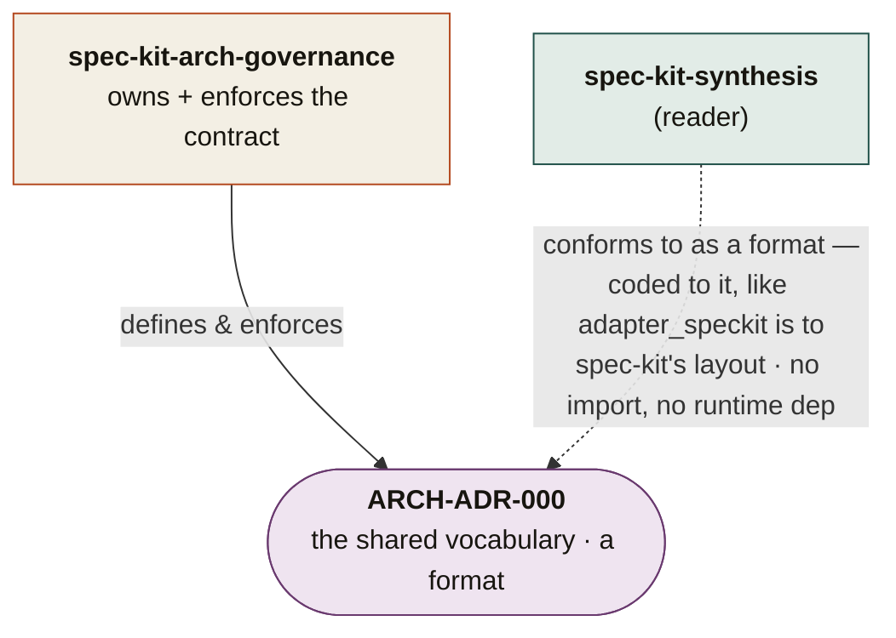

# spec-kit-arch-governance

**Keep specs, code & ADRs in sync — born-compliant SpecKit templates + a fail-closed citation validator on every spec and plan.**
*(Citation/architecture integrity — not access control, and unrelated to AI-agent capability indexing.)*

A standalone, interview-driven SpecKit extension that keeps a project's **specifications, code, and architecture decisions** from drifting apart — regardless of how many repos the project has or what they're named. It discovers your topology by asking at install, then rides the SpecKit lifecycle to keep cross-references honest.

> **Status: design / pre-build.** This repo currently holds the design ([`DESIGN.md`](./DESIGN.md)), the founding vocabulary ([`docs/adr/ARCH-ADR-000`](./docs/adr/ARCH-ADR-000-shared-vocabulary.md)), and the per-repo config shape ([`config.example.yml`](./config.example.yml)). The engine (interview, validator, hooks) is the next build — see `DESIGN.md` §10.

## What's here

| Path | What it is |
|---|---|
| [`docs/adr/ARCH-ADR-000-shared-vocabulary.md`](./docs/adr/ARCH-ADR-000-shared-vocabulary.md) | **The contract** this extension enforces — roles, relations, immutable ADR IDs, evidence tiers. |
| [`docs/adr/vocabulary.json`](./docs/adr/vocabulary.json) | The machine-readable enums (the authoritative form; vendorable by consumers). |
| [`DESIGN.md`](./DESIGN.md) | The full design strategy + staged build plan. |
| [`config.example.yml`](./config.example.yml) | The per-repo config the install interview writes. |

## Where it sits

This extension **owns and enforces** the shared vocabulary (`ARCH-ADR-000`); the reader conforms to it as a *format*, not a dependency:

The solid arrow is ownership/enforcement; the **dashed** arrow is conformance — synthesis works on ungoverned repos too, and simply reads richer signal on governed ones.

It makes the typed citations between specs, code, and ADRs **exist** (templates), stay **true** (validator), and get **enforced** (lifecycle hooks + CI) — advisory first, blocking once proven.

## Not to be confused with

- **`spec-kit-agent-governance`** — a different extension that scans a repo to generate a `GOVERNANCE.md` documenting repo state + an AI-agent capability index. That governs *what a repo is / what agents can do*; this governs *whether spec↔code↔ADR citations resolve and stay immutable*.

## License

MIT.
